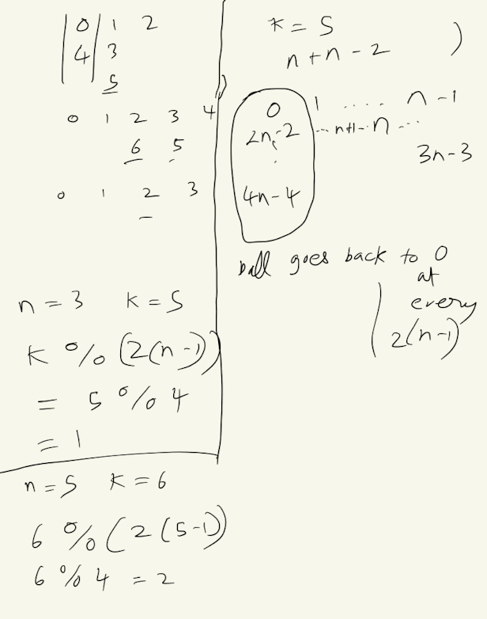

https://leetcode.com/problems/find-the-child-who-has-the-ball-after-k-seconds/description/

See Hints

class Solution:
    def numberOfChild(self, n: int, k: int) -> int:
        # Calculate the effective time after removing full cycles
        k = k % (2 * (n - 1))
        
        # Initialize the position and direction
        position = 0
        direction = 1
        
        for _ in range(k):
            # Update the position based on the current direction
            position += direction
            
            # If the ball reaches the boundaries, reverse the direction
            if position == 0 or position == n - 1:
                direction = -direction
        
        return position

